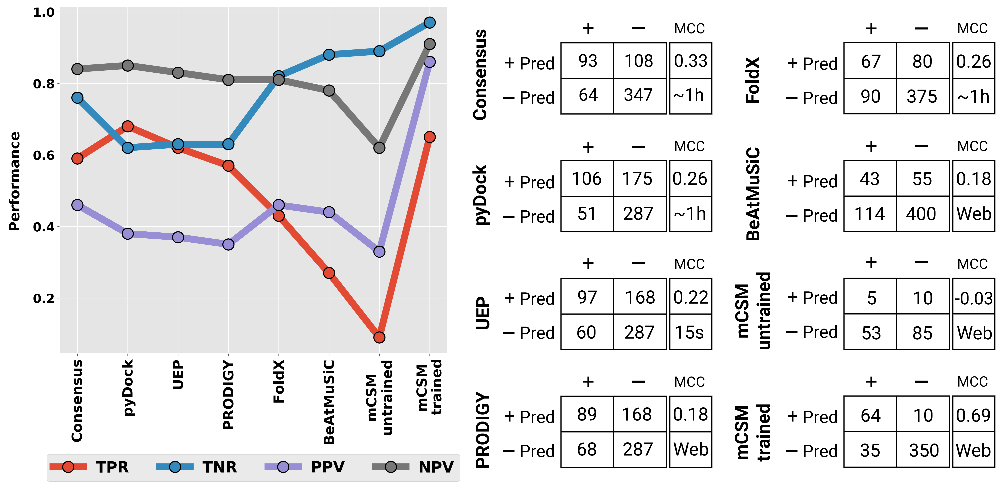

# UEP

### Welcome to UEP!

UEP is a tool for predicting the impact of mutations in a protein-protein complex. As you may know, mutations may reshape the binding affinity of a Protein-Protein interaction (PPI), and predicting its effects is of great interest in diverse disciplines, such as biotechnology or molecular interpretation of pathological mutations.

### UEP dependencies

- [prody](https://github.com/prody/ProDy) - three-dimensional searches
- [itertools](https://docs.python.org/3/library/itertools.html) - combinatorial calculations
- [glob](https://docs.python.org/3/library/glob.html) - pathing files
- [os](https://docs.python.org/3/library/os.html) - pathing files
- [multiprocessing](https://docs.python.org/3/library/multiprocessing.html) - multiprocessing to speed up training and scoring
- [compress_pickle](https://pypi.org/project/compress-pickle/) - saving trained data into a compressed pickle

### Running UEP

1. Clone UEP repository in your computer.
2. A pre-trained model with the entire interactome3D database is located in "trained_model/" folder.
3. Create a folder with the PDB files to evaluate.
4. Add the PDB files in the folder. They must be named like the pdb files in "skempi/foldx_wildtype_models/" folder.
4. Rename "path_skempi_models" variable in UEP.py with the path of the folder created before.
5. Rename "uep_results_file" variable in UEP.py with the path of the results file.
6. Execute UEP.py in python3.
7. A results file will be generated. Values higher than 1 indicate a potential improving mutation, while lower than 1 indicate a detrimental prediction.

### What makes UEP different from the state-of-the art?

Current state-of-the art methods for predicting the impact of mutations in a protein-protein rely on the description of physical energies, statistical potentials, conservation, shape complementarity, and more recently, machine learning-based approaches.

UEP moves appart from the state-of-the art and it is trained on interactome data, concretely on Interactome3D (https://interactome3d.irbbarcelona.org/).

### UEP algorithm

UEP algorithm is trained on the interactome data from the entire representative set of interactome3D. All three-dimensional complexes of the database (33,728) were scanned to feed the UEP contact matrix. UEP evaluates the mutant suitability for a given protein-protein structure by scanning the highly packed interface residues as observed in the interactome data. This process is fast and works without the need of generating mutations.

### UEP performance compared to the state-of-the art methods

Performance of all tested protein-protein affinity predictors upon mutation on the 612 selected mutations not to alanine of SKEMPI 2.0 dataset. Left panel shows the TPR, TNR, PPV, and NPV of all tested predictors. On the right panel, the confusion matrices of all predictors are depicted: experimental data condition is represented in vertical (+ or -, if mutation increases or decreases experimental binding affinity, respectively) while predictions are represented in horizontal (+ Pred or - Pred, if mutation is predicted to increase or decrease the binding affinity). In addition, MCC scores and the approximated time of analysis are also represented (for some of them, time could not be estimated since the predictions were performed via Web Server).

