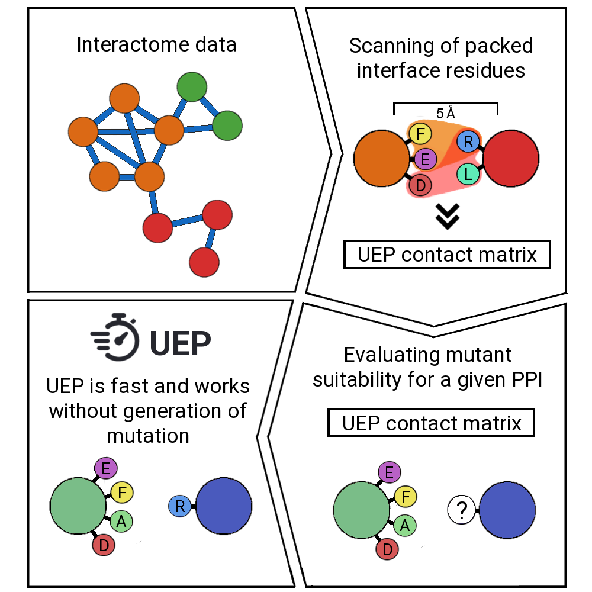

# UEP

### Welcome to UEP!
<p align="justify">
UEP is a tool for predicting the impact of mutations in a protein-protein complex. For a given PDB structure, it predicts automatically the effects of all possible mutations in the highly-packed interface positions. UEP predictions are competitive with the state-of-the art methods in the field with the advantage of being open-source code and extremelly fast in comparison, since it will take less than a second!
</p>

### UEP dependencies

- [argparse](https://docs.python.org/3/library/argparse.html) - user input
- [prody](https://github.com/prody/ProDy) - three-dimensional searches
- [itertools](https://docs.python.org/3/library/itertools.html) - combinatorial calculations
- [os](https://docs.python.org/3/library/os.html) - pathing files
- [numpy](https://numpy.org/) - calculations
- [compress_pickle](https://pypi.org/project/compress-pickle/) - reading UEP contact matrix
- [pandas](https://pandas.pydata.org/) - exporting results as csv file

### Running UEP

1. Clone UEP repository in your computer.
2. Define a PDB file and an interface to work on following this scheme.
```
python3 UEP.py --pdb=PDB.pdb --interface=A,BC
```
3. Results will be displayed and saved (csv file) in the same folder than your PDB path.

### What makes UEP different from the state-of-the art?

<p align="justify">
Current state-of-the art methods for predicting the impact of mutations in a protein-protein complex rely on the description of physical energies, statistical potentials, conservation, shape complementarity, and more recently, machine learning-based approaches.

UEP moves appart from the state-of-the art and it is trained on interactome data, concretely on Interactome3D contacts (https://interactome3d.irbbarcelona.org/).
</p>

### UEP algorithm

<p align="center">

</p>
<p align="justify">
UEP algorithm is trained on the interactome data from the entire representative set of Interactome3D. It follows a three-body contact scheme of the highly-packed residues, where one residue of one protein must be in contact with at least two residues of the other protein.
UEP will find the highly-packed residues of your PDB, and it will predict a ΔΔG based on the interactions observed in Interactome3D. This process is really fast and works without generating mutation files, which is often a time bottleneck step.
</p>

