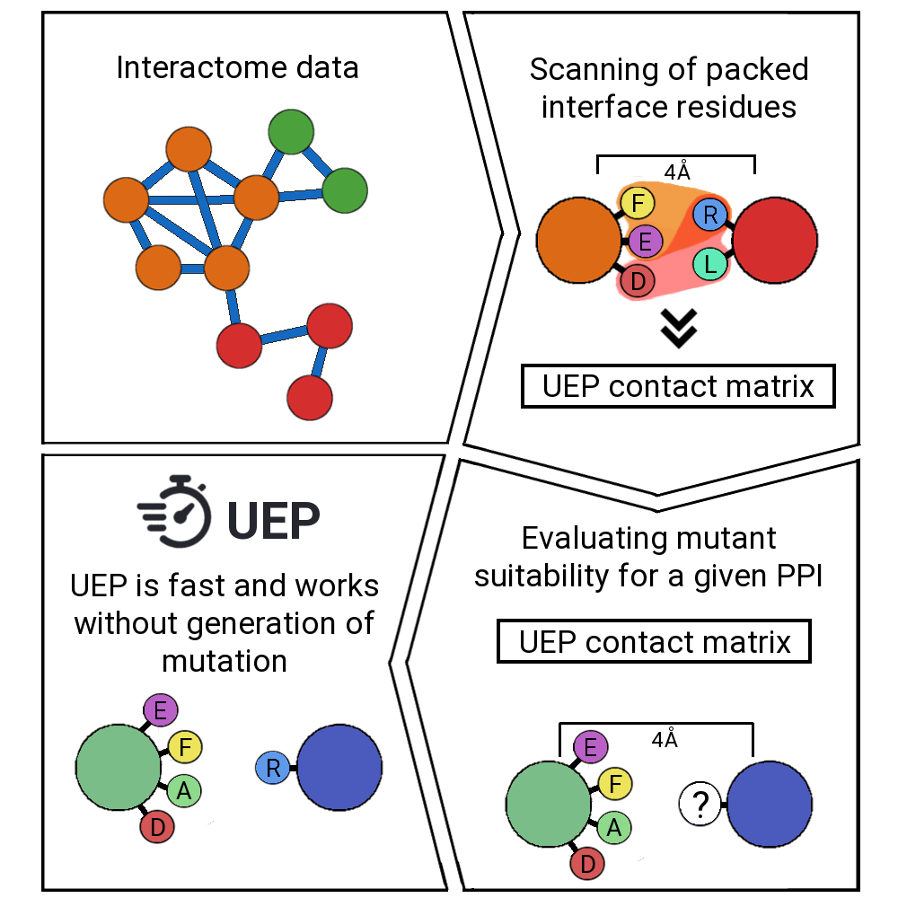

# UEP

### Welcome to UEP!

UEP is a tool for predicting the impact of mutations in a protein-protein complex. As you may know, mutations may reshape the binding affinity of a Protein-Protein interaction (PPI), and predicting its effects is of great interest in diverse disciplines, such as biotechnology or molecular interpretation of pathological mutations.

### What makes UEP different from the state-of-the art?

Current state-of-the art methods for predicting the impact of mutations in a protein-protein rely on the description of physical energies, statistical potentials, conservation, shape complementarity, and more recently, machine learning-based approaches.

UEP moves appart from the state-of-the art and it is trained on interactome data, concretely on Interactome3D (https://interactome3d.irbbarcelona.org/).

### UEP algorithm

